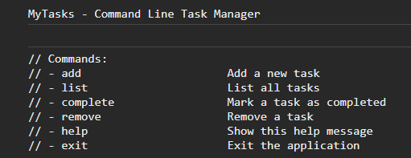

# MyTasks - Command Line Task Manager

MyTasks is a simple command-line task manager that allows you to add, list, complete, and remove tasks.

# Screenshot



## Getting Started

1. Clone the repository
2. Navigate to the project directory
3. Run the application

## Usage

- `add`: Add a new task to the list.
- `list`: List all tasks.
- `complete`: Mark a task as completed.
- `remove`: Remove a task.
- `help`: Show available commands.
- `exit`: Exit the application.

## Sample Task Entry

The tasks are stored in an array with a description and completion status.

```javascript```
{ description: "Complete project proposal", completed: false }

## Contributing

Pull requests and issues are welcome. For major changes, please open an issue first to discuss what you would like to change.

## License

This project is licensed under the MIT License - see the [LICENSE.md](LICENSE.md) file for details.

## Acknowledgments

- This project is a simple command-line application for managing your tasks.
- It can serve as a starting point for more complex task management projects.

## Author

Prabhanjan Sahu
